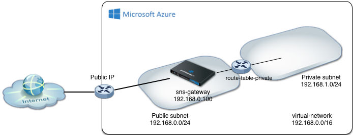

# Stormshield Network Security simple template

<a href="https://portal.azure.com/#create/Microsoft.Template/uri/https%3A%2F%2Fraw.githubusercontent.com%2Fstormshield%2Fazure-templates%2Fmaster%2Fsns%2Fsns-simple%2Ftemplate.json" target="_blank">
    
</a><a href="http://armviz.io/#/?load=https://raw.githubusercontent.com/stormshield/azure-templates/master/sns/sns-simple/template.json" target="_blank">
  
</a>

This Azure Resource Manager template deploys a SNS VM and configure a DMZ subnet.


* The virtual network has a public subnet facing Internet and a private subnet for servers
* A route table is created to route the trafic from the private network through the SNS appliance



## Note about the password:

The password must not contain the following characters: ``" ' ` \ $ ( )``

If the password can not bet set, the following error is raised:
```
ARM.ResourceOperationFailure.OSProvisioningInternalError/OSProvisioningError
ProvisioningResultMessage:[ProvisionError] Failed to provision: [OSUtilError] Failed to set password for admin
```

## Next configuration steps:

* Setup Filtering and NAT masquerading for the Private subnet on the SNS appliance
* Deploy servers in the private subnet

